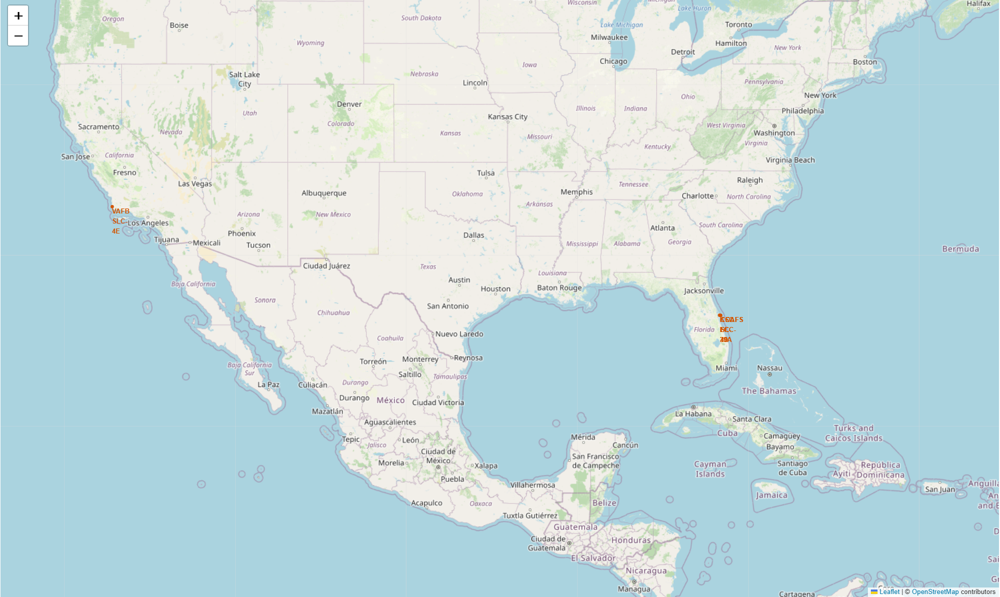

# **DATA SCIENCE CAPSTONE PROJECT**

GitHub repository for all completed notebooks and Python files used for the IBM Data Science Certificate Applied Data Science Capstone project.

## REPOSITORY STRUCTURE
- Notebooks/: Jupyter notebooks for data collection, wrangling, EDA, and modelling.
- Images/: Charts, dashboards, maps, and other screenshots.
- spacex-dash-app.py: Plotly Dash code for interactive dashboard.
- visualisation-gallery/: Comprehensive image gallery

## FILES:
1. Jupyter-labs-spaceX-data-collection-API.ipynb ----------- (Data collection using API notebook)
2. Jupyter-labs-webscraping.ipynb --------------------------- (Data collection using web scraping notebook)
3. Jupyter-labs-spaceX-data-wrangling.ipynb --------------- (Data wrangling notebook)
4. Jupyter-labs-EDA-dataviz.ipynb --------------------------- (Exploratory data analysis with visualisation notebook)
5. Jupyter-labs-EDA-SQL.ipynb ------------------------------ (exploratory data analysis with SQL)
6. spacex-dash-app.py --------------------------------------- (Code using Plotly Dash for a dashboard)
7. Jupyter-labs-launchsite-location.ipynb --------------------(Mapping launch sites using Folium)
8. Jupyter-labs-machinelearning-prediction.ipynb ---------- (Predictive modelling of launch success outcomes)

---

## PROJECT BACKGROUND
### Scenario:

SpaceX is widely considered the most successful company in the space launch industry. The organisation maintains low operational costs by providing relatively affordable rocket launch services. A significant part of these savings is due to SpaceX's innovative approach of reusing the first stage of the Falcon 9 rocket.

This project is inspired by a fictional competitor, Space Y, a new startup founded by billionaire industrialist Alon Musk. Space Y aims to establish itself as a competitor to SpaceX.

---

## OBJECTIVES
1. Determine the success rate for first-stage landings using variables such as payload, launch site, number of flights and orbit.
2. Using binary classification, determine what the best logarithm to use is when predicting a landing outcome.

---

## EXECUTIVE SUMMARY
### Key findings:
- Model Performance
  - Decision tree classifier achieved 94.44% accuracy.
     
- Top Launch Site
  - KSC LC-39A with a 76.9% success rate and the most number of successful launches.
    
- Launch Site Locations
  - Sites are near oceans and the equator, far from cities and infrastructure for safety.
   
- Success Trends    
  - Landing success improves with more launches and higher payload mass.
    
- High-Success Orbits (100% success rates)
  - ES-L1
  - GEO
  - HEO
  - VLEO
    
- Yearly Trend
  - Landing success increased consistently from 2013 to 2020.
 
### Key Visuals:
Launch site locations:

^ *Map showing SpaceX launch sites*

Launch site location outcome markers:

^ *Map showing SpaceX launch sites outcomes*

Landing success yearly trend:

^ *Line plot showing landing success (2010-2020)*

Success rate by orbit type:

^ *Bar chart comparing landing success rates across orbit types.*

### More visuals are available in the visualisations gallery.

---

## METHODOLOGY
### Data collection: 
- SpaceX’s open-source REST API 
- Web scraping from Wikipedia using Beautiful Soup

### Data wrangling:
- Filter
- Assess 
- Feature Engineer 
- Binary Encoding (0 = Unsuccessful, 1 = Successful)
  
### EDA: 
- Visualisation
- SQL
- Interactive visual analytics 
  - Folium
  - Plotly Dash
  
### Predictive analysis 
- Classification models
  - Build
  - Tune 
  - Evaluate

---
 
## DATA COLLECTION
### API:
- Request to SpaceX’s REST API
- Clean the requested data:
  - Rocket used (Booster Version, Block, Serial), 
  - Payload delivered (Payload Mass), 
  - Launch specifications (Orbit, Launch Site, Flights, Reused, Reused Count), 
  - Landing specifications (Grid Fins, Legs, Landing Pad, Longitude, Latitude), and 
  - Landing outcome (Outcome).

### Web scraping:
- Extract the Falcon 9 launch records from Wikipedia with BeautifulSoup.
- Parse the table and convert it into a Pandas data frame.
  - Payload delivered (Payload, Payload Mass). 
  - Launch specifications (Orbit, Launch Site, Date and time, Flight No, Customer, Launch outcome).

---
 
## EDA
### Charts:
- Scatter plots:
  - Flight Number vs. Payload Mass. 
  - Flight Number vs Launch Site. 
  - Launch Site vs Payload Mass.
  - Payload Mass and Orbit type.
- Bar chart
  - Success Rate vs Orbit Type.
- Line chart
  - Year vs Success Rate.
 
### Reason:
- Scatter plots:
  - Scatter plots are ideal for showing data points, distribution, correlation, and relationship across two variables. 
  - Colour-coding makes it easy to distinguish.
- Bar chart
  - Bar charts are ideal for comparing different categories or groups among discrete data categories.
- Line chart
  - A line plot is useful for visualising trends and changes over time.
 
### SQL:
- Summary of SQL queries:
  - Names of the unique launch sites.
  - 5 records where launch sites begin with the string 'CCA’.
  - Total payload mass carried by boosters launched by NASA.
  - Average payload mass carried by booster version F9 v1.1
  - Date of first successful landing on a ground pad.
  - Successful drone ship landings, mass 4k - 6k (kg).
  - Total number of mission outcomes.
  - All booster versions that have carried the maximum payload.
  - Display the month names, drone ship landing failures, booster version, and launch site in 2015.
  - Rank the count of landing outcomes, between the dates 2010-06-04 and 2017-03-20, in descending order.
 
### Interactive maps with folium:
- Added launch sites with:
  - circles
  - markers
  - text
  - pop-ups 
    
*This improves visibility and makes it easy to identify each launch site and its location.* 

  - marker clusters 
  - colour-coded booster landings
    - success (green)
    - failure (red)
      
*This allows for easy viewing of sites' landing success rates.*

  - Lines and distances between launch site CCAFS SLC-40 and
    - nearest city
    - railway line
    - highway
    - coastline
      
*This shows the proximity of the different areas to launch sites and allows us to draw conclusions with visuals.*

### Dashboard with plotly dash:
- Added:
  - Drop-down menu
    
*For selecting any or all lunch sites.*

- Slide Selector
 
*Enables custom selection of various payload mass ranges.*

- Pie Charts

*Selecting all sites allows you to compare the success percentage between all sites, while selecting individual sites enables you to view the success versus failure percentage for that specific site.*

- Scatter Charts

*Allows for the comparison of payload versus launch success. The correlation can be analysed between the selected parameters.*

---

## Predictive analysis
Classification Accuracy

Bar chart:

^ *Bar chart comparing different models.*

Model comparison:

^ *Picture showing statistics for model comparison.*

---

## AUTHOR:

Cory Bromwich, June 2025
