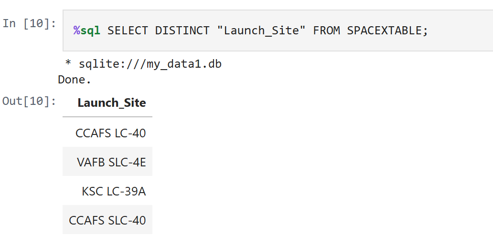
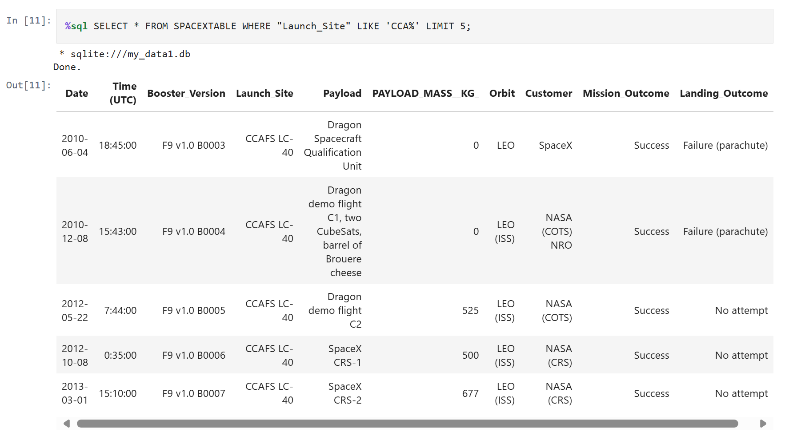
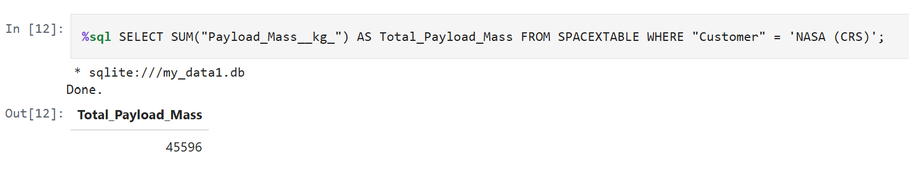
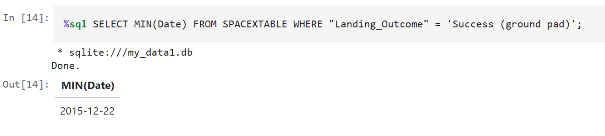
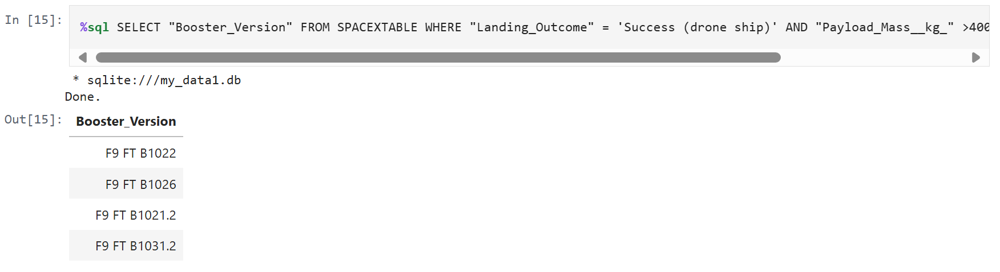
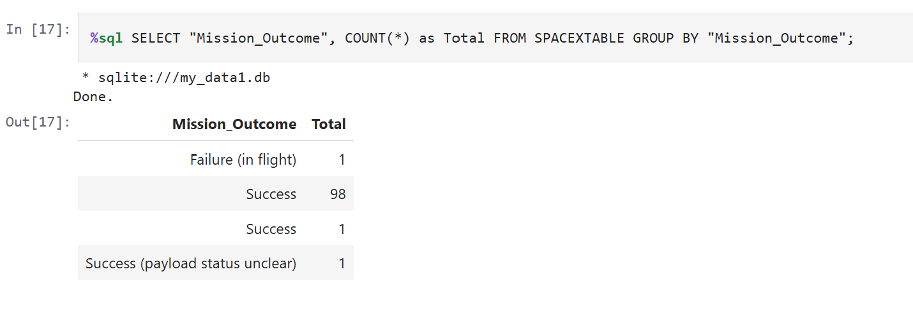
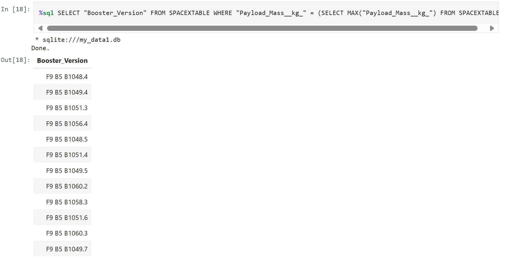
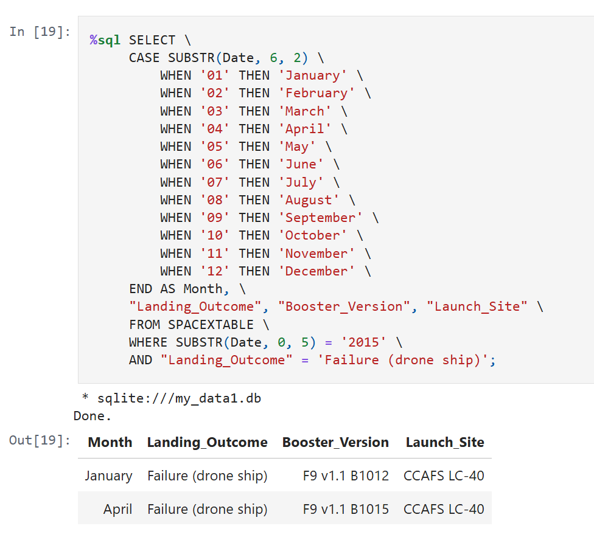
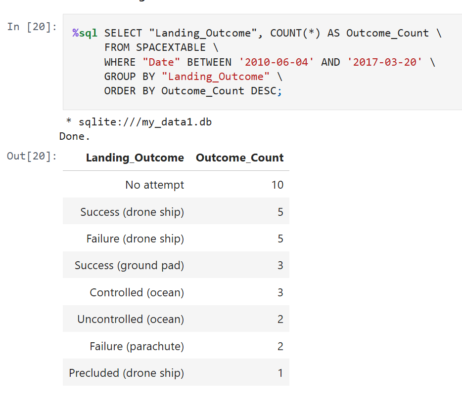

# Visualisations Gallery
This page contains all charts, dashboards, and screenshots from the Data Science Capstone Project.

## SECTIONS:
1. [Folium Maps](#FOLIUM-MAPS)
2. [Charts](#Charts)
3. [SQL](#SQL-Queries)
4. [Dashboards](#Dashboards)
5. [Modelling](#Modelling-Outcomes)
  
## IMAGE LIST

| NUMBER | IMAGE | LINK | NUMBER | IMAGE | LINK | NUMBER | IMAGE | LINK |
| :----: | :---: | :--: | :----: | :---: | :--: | :----: | :---: | :--: |
| 01 | World launch sites | [Link](#World-Launch-site-locations) | 13 | Launch Sites with String 'CCA' | [Link](#Launch-Sites-with-String) | 25 | Text | [Link](#World-Launch-site-locations) |
| 02 | USA launch sites | [Link](#USA-Launch-site-locations) | 14 | Payload Mass Carried by NASA | [Link](#Payload-Mass-Carried-by-NASA)| 26 | Text | [Link](#World-Launch-site-locations) |
| 03 |  Launch sites distances | [Link](#Launch-sites-with-distance-lines) | 15 | Average Payload for Booster | [Link](#Average-Payload-for-Booster) | 27 | Text | [Link](#World-Launch-site-locations) |
| 04 | Launch sites outcomes | [Link](#Launch-sites-with-outcome-markers) | 16 | First Successful Landing | [Link](#First-Successful-Landing) | 28 | Text | [Link](#World-Launch-site-locations) |
| 05 | Orbit vs Success Rate | [Link](#Orbit-vs-Success-Rate) | 17 | Successful Drone Ship Landings | [Link](#Successful-Drone-Ship-Landings) | 29 | Text | [Link](#World-Launch-site-locations) |
| 06 | Yearly Success Trend | [Link](#Yearly-Success-Trend) | 18 | Successful and Failed Outcomes | [Link](#Successful-and-Failed-Outcomes) | 30 | Text | [Link](#World-Launch-site-locations) |
| 07 | Launch Site vs Payload Mass | [Link](#Launch-Site-vs-Payload-Mass) | 19 | Boosters Carring Max Payloads | [Link](#Boosters-Carring-Max-Payloads) | 31 | Text | [Link](#World-Launch-site-locations) |
| 08 | Flight Number vs Payload Mass | [Link](#Flight-Number-vs-Payload-Mass) | 20 | drone ship landing failure | [Link](#drone-ship-landing-failure) | 32 | Text | [Link](#World-Launch-site-locations) |
| 09 | Flight Number vs Launch Site | [Link](#Flight-Number-vs-Launch-Site) | 21 | Ranking Landing Outcomes | [Link](#Ranking-Landing-Outcomes) | 33 | Text | [Link](#World-Launch-site-locations) |
| 10 | Flight Number vs Orbit Type | [Link](#Flight-Number-vs-Orbit-Type) | 22 | Text | [Link](#World-Launch-site-locations) | 34 | Text | [Link](#World-Launch-site-locations) |
| 11 | Payload Mass vs Orbit Type | [Link](#Payload-Mass-vs-Orbit-Type) | 23 | Text | [Link](#World-Launch-site-locations) |
| 12 | Unique Launch Sites | [Link](#Unique-Launch-Sites) | 24 | Text | [Link](#World-Launch-site-locations) |

## FOLIUM MAPS

### World Launch site locations:

^ *Fig 01, World map showing SpaceX launch locations*

### USA Launch site locations:

^ *Fig 02, USA Map showing SpaceX launch locations*

---

### Launch sites with distance lines:

^ *Fig 03, Launch site CCAFS SLC-40 Map showing distances to nearby infrastructure*

---

### Launch sites with outcome markers:

^ *Fig 04, Launch site KSC LC-39A Map with colour-coded landing outcomes (green for success, red for failure)*

---

## CHARTS

### Orbit vs Success Rate:

^ *Fig 05, Bar chart comparing landing success rates by orbit type*

---

### Yearly Success Trend:

^ *Fig 06, Line chart showing the landing success trends from 2010 to 2020*

---

### Launch Site vs Payload Mass:

^ *Fig 07, Scatter plot showing the relationship between launch site and payload mass (0=fail, 1=success)*

---

### Flight Number vs Payload Mass:

^ *Fig 08, Scatter plot showing the relationship between the Flight Number and Payload Mass (0=fail, 1=success)*

---

### Flight Number vs Launch Site:

^ *Fig 09, Scatter plot showing the relationship between the Flight Number and Launch Site (0=fail, 1=success)*

---

### Flight Number vs Orbit Type:

^ *Fig 10, Scatter plot showing the relationship between the Flight Number and Orbit Type (0=fail, 1=success)*

---

### Payload Mass vs Orbit Type:

^ *Fig 11, Scatter plot showing relationship between launch site and payload mass (0=fail, 1=success)*

---

## SQL QUERIES

### Unique Launch Sites:

^ *Fig 12, SQL Query result showing all unique SpaceX launch sites*

---

### Launch Sites with String:

^ *Fig 13, SQL Query result showing 5 records where launch sites begin with the string 'CCA'*

---

### Payload Mass Carried by NASA:

^ *Fig 14, SQL Query result showing the total payload mass carried by boosters launched by NASA (CRS)*

---

### Average Payload for Booster:

^ *Fig 15, SQL Query result showing the average payload mass carried by booster version F9 v1.1*

---

### First Successful Landing:

^ *Fig 16, SQL Query result showing a date when the first successful landing outcome on a ground pad was achieved*

---

### Successful Drone Ship Landings:

^ *Fig 17, SQL Query result listing the names of the boosters that have been successful in drone ship landings and have a payload mass greater than 4000kg but less than 6000kg*

---

### Successful and Failed Outcomes:

^ *Fig 18, SQL Query result showing the total number of successful and failed mission outcomes*

---

### Boosters Carring Max Payloads:

^ *Fig 19, SQL Query result showing the booster versions that have carried the maximum payload mass (subquery)*

---

### drone ship landing failure:

^ *Fig 20, SQL Query result that will display the month names, failure landing outcomes on drone ships, booster versions, and launch site for the months in the year 2015*

---

### Ranking Landing Outcomes:

^ *Fig 21, SQL Query result Ranking the count of landing outcomes, such as Failure (drone ship) or Success (ground pad), between the dates 2010-06-04 and 2017-03-20, in descending order*

---

## DASHBOARD

All Launch Sites: Dashboard showing success rates across all launch sites.

KSC LC-39A: Dashboard for KSC LC-39A success rates.

## MODELLING OUTCOMES

