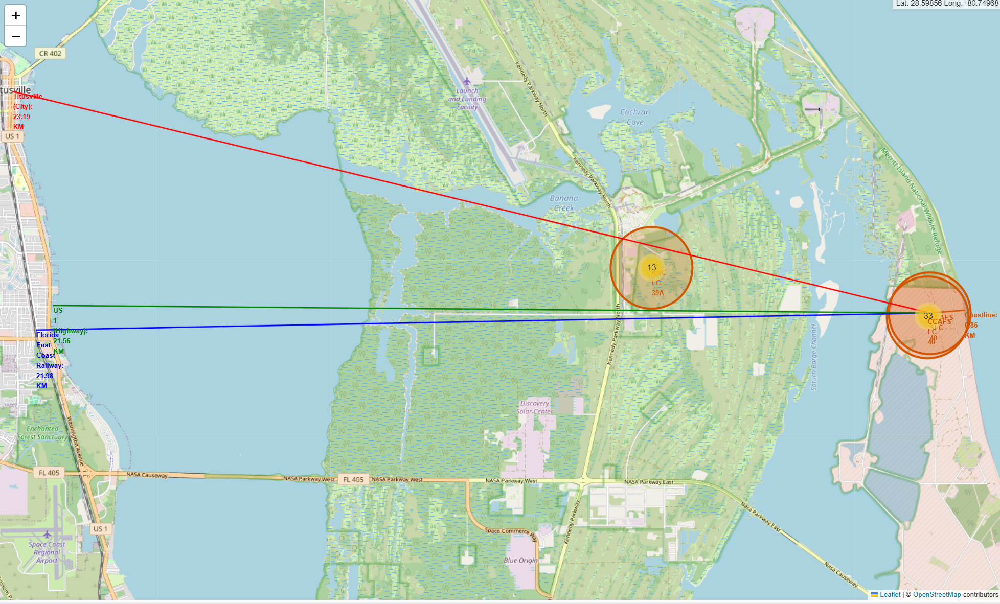
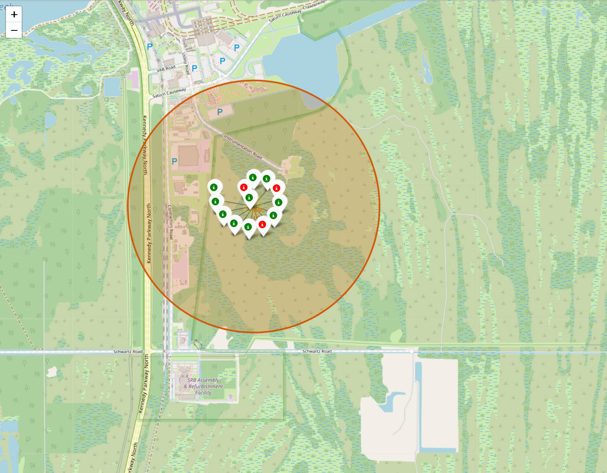
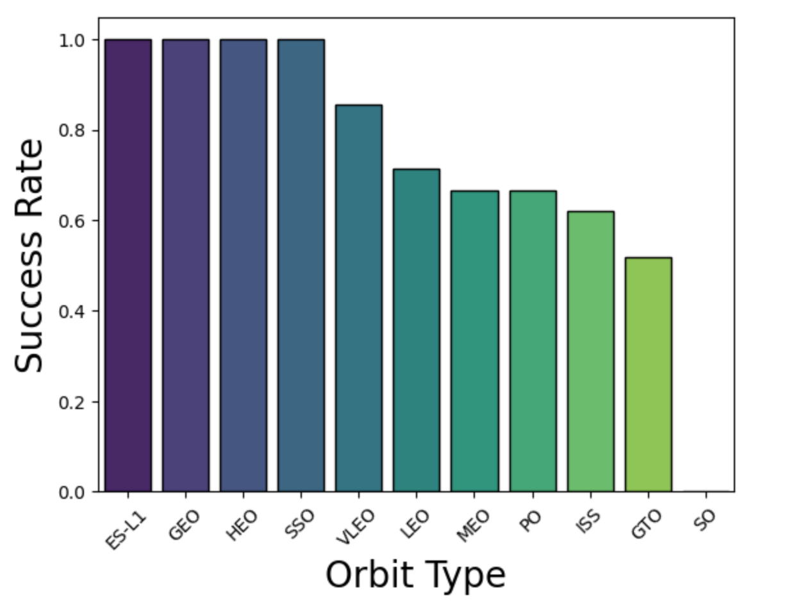
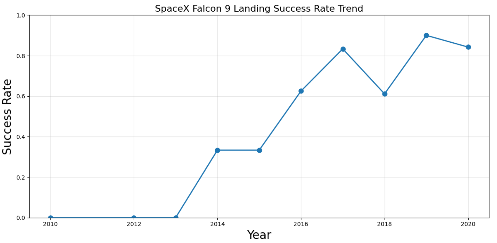
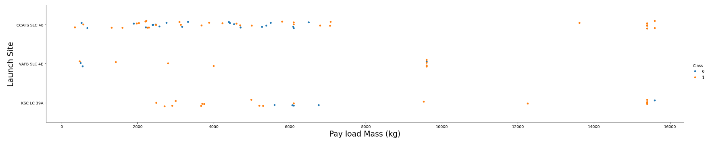
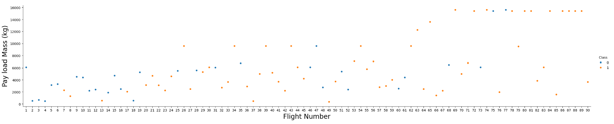
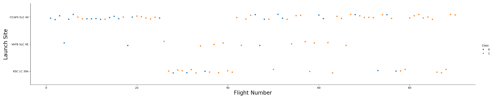
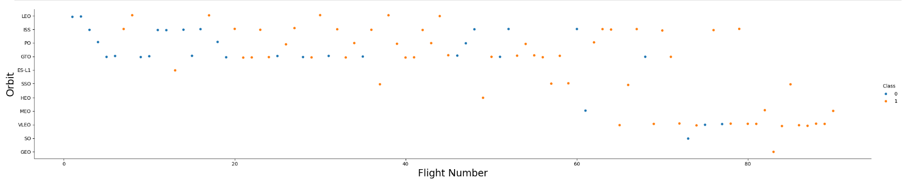
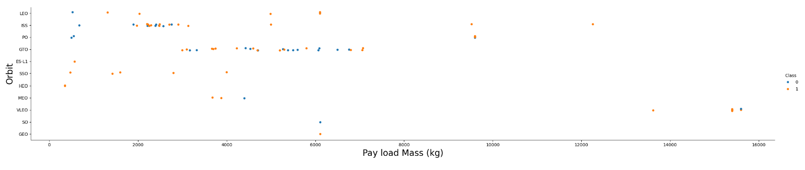

# Visualisations Gallery
This page contains all charts, dashboards, and screenshots from the Data Science Capstone Project.

## SECTIONS:
1. [Folium Maps](#FOLIUM-MAPS)
2. [Charts](#Charts)
3. [SQL](#SQL-Queries)
4. [Dashboards](#Dashboards)
5. [Modelling](#Modelling-Outcomes)
  
## IMAGE LIST

| NUMBER | IMAGE | LINK | NUMBER | IMAGE | LINK | NUMBER | IMAGE | LINK |
| :----: | :---: | :--: | :----: | :---: | :--: | :----: | :---: | :--: |
| 01 | World launch sites | [Link](#World-Launch-site-locations) | 13 | Text | [Link](#World-Launch-site-locations) | 25 | Text | [Link](#World-Launch-site-locations) |
| 02 | USA launch sites | [Link](#USA-Launch-site-locations) | 14 | Text | [Link](#World-Launch-site-locations)| 26 | Text | [Link](#World-Launch-site-locations) |
| 03 |  Launch sites distances | [Link](#Launch-sites-with-distance-lines) | 15 | Text | [Link](#World-Launch-site-locations) | 27 | Text | [Link](#World-Launch-site-locations) |
| 04 | Launch sites outcomes | [Link](#Launch-sites-with-outcome-markers) | 16 | Text | [Link](#World-Launch-site-locations) | 28 | Text | [Link](#World-Launch-site-locations) |
| 05 | Orbit vs Success Rate | [Link](#Orbit-vs-Success-Rate) | 17 | Text | [Link](#World-Launch-site-locations) | 29 | Text | [Link](#World-Launch-site-locations) |
| 06 | Yearly Success Trend | [Link](#Yearly-Success-Trend) | 18 | Text | [Link](#World-Launch-site-locations) | 30 | Text | [Link](#World-Launch-site-locations) |
| 07 | Launch Site vs Payload Mass | [Link](#Launch-Site-vs-Payload-Mass) | 19 | Text | [Link](#World-Launch-site-locations) | 31 | Text | [Link](#World-Launch-site-locations) |
| 08 | Flight Number vs Payload Mass | [Link](#Flight-Number-vs-Payload-Mass) | 20 | Text | [Link](#World-Launch-site-locations) | 32 | Text | [Link](#World-Launch-site-locations) |
| 09 | Flight Number vs Launch Site | [Link](#Flight-Number-vs-Launch-Site) | 21 | Text | [Link](#World-Launch-site-locations) | 33 | Text | [Link](#World-Launch-site-locations) |
| 10 | Flight Number vs Orbit Type | [Link](#Flight-Number-vs-Orbit-Type) | 22 | Text | [Link](#World-Launch-site-locations) | 34 | Text | [Link](#World-Launch-site-locations) |
| 11 | Payload Mass vs Orbit Type | [Link](#Payload-Mass-vs-Orbit-Type) | 23 | Text | [Link](#World-Launch-site-locations) |
| 12 | Text | [Link](#World-Launch-site-locations) | 24 | Text | [Link](#World-Launch-site-locations) |

## FOLIUM MAPS

### World Launch site locations:

^ *Fig 01, World map showing SpaceX launch locations*

### USA Launch site locations:

^ *Fig 02, USA Map showing SpaceX launch locations*

---

### Launch sites with distance lines:

^ *Fig 03, Launch site CCAFS SLC-40 Map showing distances to nearby infrastructure*

---

### Launch sites with outcome markers:

^ *Fig 04, Launch site KSC LC-39A Map with colour-coded landing outcomes (green for success, red for failure)*

---

## CHARTS

### Orbit vs Success Rate:

^ *Fig 05, Bar chart comparing landing success rates by orbit type*

---

### Yearly Success Trend:

^ *Fig 06, Line chart showing the landing success trends from 2010 to 2020*

---

### Launch Site vs Payload Mass:

^ *Fig 07, Scatter plot showing the relationship between launch site and payload mass (0=fail, 1=success)*

---

### Flight Number vs Payload Mass:

^ *Fig 08, Scatter plot showing the relationship between the Flight Number and Payload Mass (0=fail, 1=success)*

---

### Flight Number vs Launch Site:

^ *Fig 09, Scatter plot showing the relationship between the Flight Number and Launch Site (0=fail, 1=success)*

---

### Flight Number vs Orbit Type:

^ *Fig 10, Scatter plot showing the relationship between the Flight Number and Orbit Type (0=fail, 1=success)*

---

### Payload Mass vs Orbit Type:

^ *Fig 11, Scatter plot showing relationship between launch site and payload mass (0=fail, 1=success)*

---

## SQL QUERIES

Unique Launch Sites:Query result showing all unique SpaceX launch sites.

First Successful Ground Landing:Query result showing the date of the first successful ground pad landing.

## DASHBOARD

All Launch Sites: Dashboard showing success rates across all launch sites.

KSC LC-39A: Dashboard for KSC LC-39A success rates.

## Modelling Outcomes

