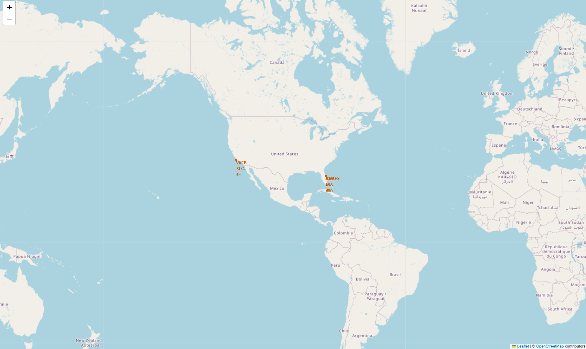
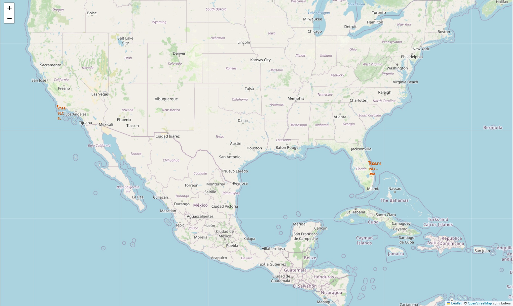
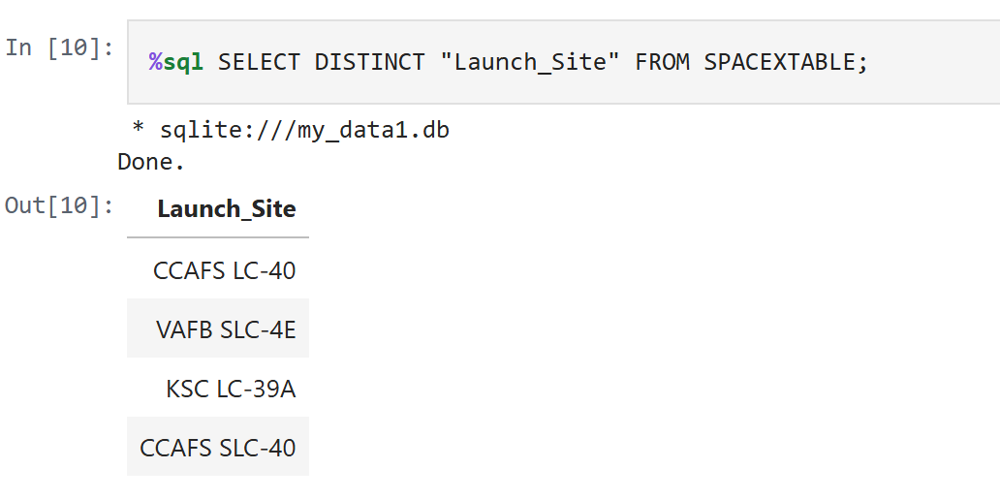
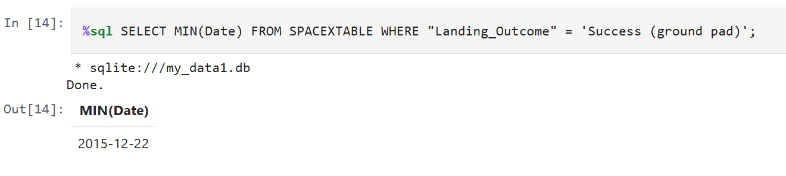

# Visualisations Gallery
This page contains all charts, dashboards, and screenshots from the Data Science Capstone Project.

Sections:
1. [Folium Maps](#Folium-Maps)
2. [Charts](#Charts)
3. [SQL](#SQL-Queries)
4. [Dashboards](#Dashboards)
5. [Modelling](#Modelling-Outcomes)
  
Image List

 NUMBER | IMAGE | LINK | NUMBER | IMAGE | LINK | NUMBER | IMAGE | LINK |
 | :---: | :---- | :--- | :---: | :---- | :--- | :---: | :---- | :--- |
 | 01 | Text | x,xxx | 13 | Text | x,xxx | 24 | Text | x,xxx |
 | 02 | Text | x,xxx | 14 | Text | x,xxx | 25 | Text | x,xxx |
 | 04 | Text | x,xxx | 15 | Text | x,xxx | 26 | Text | x,xxx |
 | 05 | Text | x,xxx | 16 | Text | x,xxx | 27 | Text | x,xxx |
 | 06 | Text | x,xxx | 17 | Text | x,xxx | 28 | Text | x,xxx |
 | 07 | Text | x,xxx | 18 | Text | x,xxx | 29 | Text | x,xxx |
 | 08 | Text | x,xxx | 19 | Text | x,xxx | 30 | Text | x,xxx |
 | 09 | Text | x,xxx | 20 | Text | x,xxx | 31 | Text | x,xxx |
 | 10 | Text | x,xxx | 21 | Text | x,xxx | 32 | Text | x,xxx |
 | 11 | Text | x,xxx | 22 | Text | x,xxx | 33 | Text | x,xxx |
 | 12 | Text | x,xxx | 23 | Text | x,xxx | 34 | Text | x,xxx |

## Folium Maps

Folium_maps_outcome_markers.png

Folium_worldmap_markers_launchsites_zoomin.png

folium_maps_distance_lines.png

### Launch site locashens:

^
*World map showing SpaceX launch locations*

^*Map of the USA showing SpaceX launch locations*

---

### Launch sites with distance lines:

Map showing distances from CCAFS SLC-40 to nearby infrastructure.

Launch sites with outcome markers:

Map with colour-coded landing outcomes (green for success, red for failure).

## Charts

Orbit vs. Success Rate:Bar chart comparing landing success rates by orbit type.

Yearly Success Trend:Line chart showing landing success trends from 2013 to 2020.

Flight Number vs. Payload Mass:Scatter plot showing relationship between flight number and payload mass.

## SQL Queries

Unique Launch Sites:Query result showing all unique SpaceX launch sites.

First Successful Ground Landing:Query result showing the date of the first successful ground pad landing.

## Dashboards

All Launch Sites:Dashboard showing success rates across all launch sites.

KSC LC-39A:Dashboard for KSC LC-39A success rates.

## Modelling Outcomes

